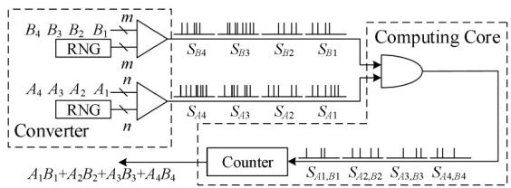
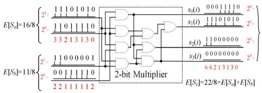
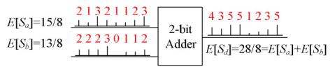
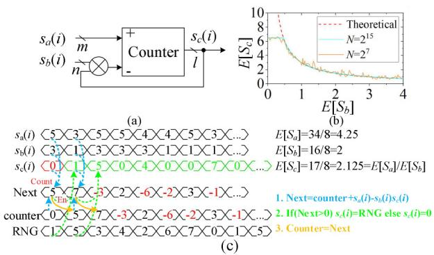
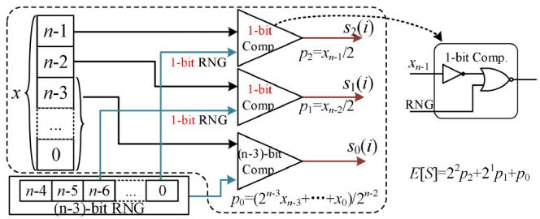
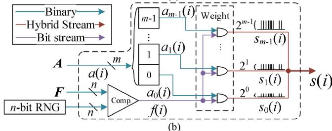
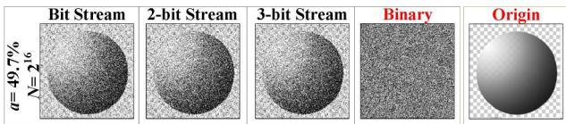
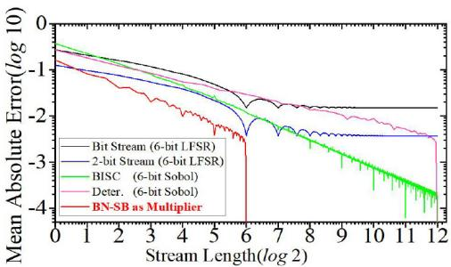

# Hybrid Logic Computing of Binary and Stochastic

Hongge Li , Member, IEEE, and Yuhao Chen , Graduate Student Member, IEEE

Abstract—Binary logic is applied internally to almost all dig-ital signal processing and computer systems, because binarylogic is direct implemented in CMOS circuits. Stochastic logicis achieved through its particular representation of data, whichuses the probability of the logic level being ON to represent data.Stochastic logic computing is a type of logic computation basedon stochastic bit stream instead of the binary numbers. Thisletter proposes a hybrid computing system of binary logic andstochastic logic, called hybrid logic. The study discusses how togenerate hybrid logic circuits, and demonstrates the propertiesof hybrid logic circuits.

Index Terms—Field-programmable gate array (FPGA), hybridlogic computing, low latency, stochastic computing (SC).

# I. INTRODUCTION

HE PROPERTIES of stochastic logic have been the sub-ject of intensive studies for several years. Stochastic logicis a mathematical problem based on probability and mean,and stochastic logic possessing special properties can be eas-ily generated by simple logical circuits to replace complexcircuit based on binary logic. On the other hand, in binarylogic (Boolean algebra), a variable at any point in the systemcan assume only one of two values, denoted as 0 or 1.

Conventional digital computing requires much more powerconsumption when the size of computation is increasing. Thiscauses a tradeoff between the size of the computation andthe speed of its solution. Thus, a new data-processing system,stochastic computing (SC), has been considered, which makesthe maximum use of every logic gate for computation pur-poses, and its computations distributed in space and time.

The speed advantage of binary logic in performing digitalcomputations is significant. SC is an important method forpulse computation and was advocated by Gaines in 1969 [1].In the SC paradigm, computation is performed on stochasticbit stream (SB) instead of binary number (BN). The SB is rep-resented by the probability of firing “1” based on the streamlength of the accumulation time [1], [2]. The required com-puting power of the SC is completely distributed throughoutthe low-cost logic gate. The binary logic circuit is an effi-ciently coded representation of data, where the binary logicrequires $\log _ { 2 } N$ ordered binary levels. Contrarily, SC is theleast efficient in the representation of data, which requires $N ^ { 2 }$unordered binary levels [1]. However, conventional SC savesconsiderable hardware resources and power at the expense ofefficiency.

Fig. 1. Classic SC based on SB.

In the SC paradigm, digital computation is performed on SBinstead of BN, which has a significant advantage in the occu-pation of hardware in processing complex functions. SC hasbeen applied to a wide variety of applications [2], [3], suchas image processing [4], communication encoding [5], neu-ral networks [6], and deep learning [7]. Sim et al. proposednew multiplication methods to reduce stream length andoptimize the problem of high latency. Najafi and Lilja [8]proposed deterministic methods to achieve an accurate calcu-lation. Parhi [9] proposed hybrid unipolar and bipolar formatsto achieve better energy efficiency. Liu and Han [10] used aSobol sequence to optimize the problem of poor precision.Canals et al. [11] proposed a new encoding method, whichuses fractional form to represent a value with two groups ofSB and extends the range of pulse representation to the wholereal number axis.

High latency is essentially caused by low information carry-ing ability of 1-bit stochastic stream in conventional SC. Whenthe bit stream length of stochastic logic is equal to $N .$ , it canonly represent $N$ different data. Clearly, the efficiency of car-rying information for bitstream is weaker than that of BN.Some researchers have made some works to improve the effi-ciency of SC encoding, trying to use multibit stream to reducelatency [12], [13], or using thermometer encoder [14].

High latency and low accuracy are still the major designchallenges for the hardware circuits of SC, although SC hasthe advantages of hardware occupation and noise tolerance.To solve the intrinsic fundamental problem and major designchallenges, we proposed a new computing method. The maincontributions of this study are as follows.

1) Hybrid logic computing of binary logic and stochasticlogic is proposed for the hybrid logic SC (HSC).

2) The properties and relationship of hybrid, stochastic, andbinary logics are discussed.

3) The hybrid logic circuit is designed for a multiplier,adder, divider, and the converters of BN and SB.

# II. STOCHASTIC COMPUTING

# A. Existing SC Methods

The classic multiplication of SC [1] based on a stochas-tic bitstream is shown in Fig. 1. The stochastic bit streamgenerator comprises a random number generator (RNG) andcomparator. Through the bit stream generator, $A$ and $B$ areconverted into stochastic bit streams $S _ { A }$ and $S _ { B }$ , respec-tively. The probabilities of the two streams being “1” are

Manuscript received 23 March 2022; revised 20 April 2022; accepted23 April 2022. Date of publication 28 April 2022; date of current ver-sion 24 November 2022. This work was supported in part by the NationalNatural Science Foundation of China under Grant 62071019. This manuscriptwas recommended for publication by D. Goswami. (Corresponding author:Hongge Li.)

The authors are with the College of Electronic Information Engineering,Beihang University, Beijing 100191, China (e-mail: honggeli@buaa.edu.cn;zy1902608@buaa.edu.cn).

Digital Object Identifier 10.1109/LES.2022.3170457

Fig. 2. Multiplication of HSC.

Fig. 3. Addition of HSC.

$P ( S _ { A } ) \ = \ A / 2 ^ { n }$ and $P ( S _ { B } ) ~ = ~ B / 2 ^ { m }$ , respectively. A newstochastic bit stream $S _ { A , B }$ is obtained after passing throughthe “AND” gate. The probability of the output stream being“1” is ${ \cal P } ( S _ { A , B } ) = { \cal P } ( S _ { A } ) { \cal P } ( S _ { B } ) = \mathrm { \bar { } } A B / 2 ^ { n + m }$ , which realizes themultiplication of two input streams $S _ { A }$ and $S _ { B }$ . The counteraccumulates four stochastic streams $S _ { A 1 , B 1 }  – S _ { A 4 , B 4 }$ one by one,to obtain the full result of $A _ { 1 } B _ { 1 } + A _ { 2 } B _ { 2 } + A _ { 3 } B _ { 3 } + A _ { 4 } B _ { 4 }$ .

The SC results may be inaccurate for the following reasons.First, two input streams should be independent; otherwise,$P ( S _ { A , B } ) = P ( S _ { A } ) P ( S _ { B } )$ is false. Second, the stochastic streamis essentially a result of the $N _ { F }$ -fold Bernoulli experiment, andthe number of “1” contained in the stream satisfies the binomialdistribution [11]. The length of an SB increases exponentiallywith the desired resolution. For example, to obtain the prob-ability of a stream with 8-bit resolution, one must observe atleast $\overline { { 2 } } ^ { 1 6 }$ bits of stream length using classic SC [15].

# B. Hybrid Logic of Stochastic and Binary

SC usually uses the probability of “1” in a stream to repre-sent a value. $x ( 1 ) , x ( 2 ) , \ldots , x ( N )$ represent the stream. Every$x ( i )$ in the bit stream is generated by a discrete random vari-able $X$ with a probability distribution of $P ( X = 1 ) = p$and $P ( X = 0 ) = 1 - p$ , where $p$ is the probability value.According to the definition of expectation in a previous study,the expectation of $X$ can be obtained as follows [17]:

$$
E [ X ] = 1 \cdot p + 0 \cdot (1 - p) = p. \tag {1}
$$

According to (1), it can also be regarded as that SC usesthe discrete random variable $X$ as a signal source to generate astochastic stream, and $E [ X ]$ represents the value of the stream.Because $X = 1$ or 0 in a conventional SC, the stochastic pulseare 1-bit streams.

If SC is understood as described above, the discrete randomvariable should have a larger range instead of being limited to a1-bit stream. Therefore, the SC can be extended to use multibitstreams instead of 1-bit streams. Examples of the computationson the 2-bit stream are shown in Figs. 2 and 3. Because thisnew stochastic stream has the characteristics of both conven-tional stochastic logic and binary logic, we refer to the newmethod as hybrid logic computing of stochastic and binary,and namely, the multibit stochastic stream as a hybrid stream.

1) Multiplication and Addition: If the hybrid streams $s _ { a } ( i )$and $s _ { b } ( i )$ are multiplied number by number, a new hybridstream $s _ { c } ( i )$ can be obtained

$$
s _ {c} (i) = s _ {a} (i) s _ {b} (i). \tag {2}
$$

According to the probability theory if $s _ { a } ( i )$ and $s _ { b } ( i )$ areindependent, the expectation of $s _ { c } ( i )$ is the product of $E [ S _ { a } ]$and $E [ S _ { b } ]$ , as shown in (3). Therefore, (2) realizes multiplica-tion of the two hybrid streams.

$$
E \left[ S _ {c} \right] = E \left[ S _ {a} S _ {b} \right] = E \left[ S _ {a} \right] E \left[ S _ {b} \right] \tag {3}
$$

Fig. 4. Division of HSC. (a) Circuit for division computing. (b) Accuracyevaluation of the division circuit, $E [ S _ { c } ] = 3 / E [ S _ { b } ]$ . (c) Example for divisioncircuit.

By adding two hybrid streams $s _ { a } ( i )$ and $s _ { b } ( i )$ number bynumber, a new hybrid stream $s _ { d } ( i )$ can be obtained

$$
s _ {d} (i) = s _ {a} (i) + s _ {b} (i). \tag {4}
$$

According to the probability theorem, the expectation of$s _ { d } ( i )$ is equal to $E [ S _ { a } ] + E [ S _ { b } ]$ , as shown in (5). Therefore, (4)realizes the addition of two hybrid streams

$$
E \left[ S _ {d} \right] = E \left[ S _ {a} + S _ {b} \right] = E \left[ S _ {a} \right] + E \left[ S _ {b} \right]. \tag {5}
$$

Using Fig. 2 to explain the details, BNs 16 and 11 shouldfirst be scaled into $[ 0 , 2 ^ { 2 } - 1 ]$ to satisfy the representationrange of the 2-bit hybrid stream. Therefore, 2-bit streams areencoded with $E [ S _ { a } ] = 1 6 / 8$ and $E [ S _ { b } ] = 1 1 / 8$ to represent16 and 11, respectively. Using this hybrid logic, $n$ -bit $( n \geq 2 )$binary multiplication is realized using a 2-bit multiplier, asshown in Fig. 2. The $n$ -bit $( n \geq 2 )$ ) addition is realized usinga 2-bit adder, as shown in Fig. 3.

The hybrid logic stream comprises not only 2-bit. Whenan $m$ -bit hybrid stream is used to represent $n$ -bit binary data$( m ~ \leq ~ n )$ , $n$ -bit binary multiplication can be operated by an$m$ -bit multiplier.

2) Division: Fig. 4(a) shows the division circuit withHSC. Here, $s _ { a } ( i )$ and $s _ { b } ( i )$ are input hybrid streams,$\begin{array} { c c l } { i } & { = } & { 0 , 1 , \dots , N - 1 . } \end{array}$ , and the result of division $s _ { c } ( i )$is a hybrid stream. The counter is used to compute$\begin{array} { r } { \sum _ { i = 1 } ^ { n } \mathbb { I } \overline { { s _ { a } } } ( i ) - s _ { c } ( i ) s _ { b } ( i ) \mathbb { I } } \end{array}$ . When the expectation of the counteris equal to 0, $E [ S _ { c } S _ { b } ] = E [ S _ { a } ]$ is established. Under this con-dition, if $S _ { c }$ and $S _ { b }$ are independent, $E [ S _ { c } ] E [ S _ { b } ] = E [ S _ { a } ]$ isobtained. Thus, if the counter is close to 0, $s _ { c } ( i )$ approaches thedivision result. Setting the initial value of counter and $s _ { c } ( 0 )$ tozero and using an RNG to control the value of $s _ { c } ( i )$ , whencounter ${ > } 0$ , $s _ { c } ( i ) = \mathsf { R N G }$ . When counter ${ < } 0$ , $s _ { c } ( i ) = 0$ . Theaccuracy test of the division circuit is shown in Fig. 4 (b),$E [ S _ { c } ] = 3 / E [ S _ { b } ]$ , when $E [ S _ { a } ] = 3$ and $n = m = l = 3$ . Thedata flow of division circuit is shown as Fig. 4(c).

3) BN–SB Converter: Two types of BN-SB circuits, Type-A and Type-B, were proposed as shown in Fig. 5. BN-SB(Type-A) uses one BN $x$ (n-bit) as the input to encode themultibit stream. For example, the encoding process for $m$ -bitstochastic stream is shown in Fig. 5(a), where $x _ { i }$ representsthe ith bit of $x$ . The low $( n - m + 1 )$ -bit of $x$ and RNG iscompared to obtain the bit stream $s _ { 0 } ( i )$ . The high $( m - 1 )$ -bit of $x$ is compared with 1-bit RNGs, respectively, to obtain$s _ { 1 } ( i ) , s _ { 2 } ( i ) \cdot \cdot \cdot s _ { m - 1 } ( i )$ . Here, 1-bit RNGs can be obtained froman arbitrary bit of the $( n - m + 1 )$ -bit RNG. In Fig. 5(a), mis equal to 3 as an example, and 3-bit stream output versusinput $x$ has the following relationship:

$$
E \left[ S _ {0} \right] = p _ {0} = \left(2 ^ {n - 3} x _ {n - 3} + \dots + 2 ^ {1} x _ {1} + x _ {0}\right) / 2 ^ {n - 2} \tag {6}
$$

$$
E \left[ S _ {i} \right] = p _ {i} = x _ {n - 3 + i} / 2, i = 1, 2. \tag {7}
$$

Fig. 5. BN–SB converter for hybrid logic computing. (a) Type-A uses onebinary data to encode 3-bit stream. (b) Type-B uses two binary data to encodehybrid stream.

Thus, the expectation of the 3-bit stream output by BN-SB(Type-A) is proportional to $x _ { \ast }$ , which realizes multibit streamencoding for BN $x$

$$
\begin{array}{l} E [ S ] = 2 ^ {2} p _ {2} + 2 ^ {1} p _ {1} + 2 ^ {0} p _ {0} \\ = \left(2 ^ {n - 1} x _ {n - 1} + 2 ^ {n - 2} x _ {n - 2} \dots + x _ {0}\right) / 2 ^ {n - 2} = x / 2 ^ {n - 2}. \tag {8} \\ \end{array}
$$

Type-B, illustrated in Fig. 5(b), is another method for encod-ing multibit streams, which uses two BNs to encode a multibitstream. The output multibit stream represents the product oftwo input BNs. The BN $x ( n + m - { \mathrm { b i t } } )$ to be encoded is theproduct of $y$ and $p$ , where $x = y \cdot p = y \cdot z / 2 ^ { n } .$ . z is an $n$ -bit, $y$ isan $m$ -bit, and $p \in [ 0 , 1 )$ . The bit stream $f ( i )$ representing $p$ isgenerated by the comparison between $z$ and a random number,which is the same as the BN–SB circuit for a conventional SC

$$
E [ F ] = p = z / 2 ^ {n}. \tag {9}
$$

Thereafter, if $a ( i ) = y$ and $i = 1 , 2 , \dots , N$ , then $E [ A ] = y$

Finally, $s ( i )$ is obtained by multiplying $a ( i )$ and $f ( i )$as shown on the right-hand side of Fig. 5. Here,$a _ { 0 } ( i ) , a _ { 1 } ( i ) , \dots , a _ { m - 1 } ( i )$ indicate $m$ bits of $a ( i ) . m$ bits of $s ( i )$have the same representation as $a ( i )$

$$
s (i) = \sum_ {j = 0} ^ {m - 1} 2 ^ {j} s _ {j} (i) = \sum_ {j = 0} ^ {m - 1} 2 ^ {j} [ a _ {j} (i) \cdot f (i) ]. \tag {10}
$$

The value expressed by $s ( i )$ is determined by the expectationof $s ( i )$ . Because $A$ is a constant, the expectation is obtained asshown in (11). Therefore, $s ( i )$ is a multibit stream representing$x _ { \ast }$ , and the circuit achieves the purpose of converting the BN$x$ into a multibit stream

$$
E [ S ] = \left(\sum_ {j = 0} ^ {m - 1} 2 ^ {j} y _ {j}\right) E [ F ] = y \cdot E [ F ] = y \cdot p = x. \tag {11}
$$

Hybrid logic computing has a lower requirement for streamlength $N$ than conventional bit stream to achieve the sameresolution. When converting an $n$ -bit BN $x$ to an $( m + 1 )$ -bit stream, it is sufficient to have an $( n - m )$ -bit resolution$( N = 2 ^ { n - m } - 1 )$ ) for every bit stream of the $( m + 1 )$ -bit streamto represent $x _ { i }$ , where an $n$ -bit resolution $( N = 2 ^ { n } - 1 )$ isrequired for classic SC.

When $m \ = \ 0$ , the hybrid logic stream degrades into aclassic bit stream. It is an extreme situation that has the lowest

Fig. 6. Experiment for noise tolerance of HSC.

hardware occupation but the worst latency. When $m = n - 1$ ,the hybrid logic stream is converted into a BN. This is anotherextreme situation that has the best latency and largest hardwareoccupation. Through this hybrid logic, latency and hardwareoccupation can be traded off instead of choosing between twoextreme situations.

# III. DISCUSSION FOR HYBRID LOGIC COMPUTING

# A. Noise Tolerance of Hybrid Logic

In a noisy environment, it is assumed that every bit ofstochastic stream has the same bit flip rate $a \in [ 0 , 0 . 5 ]$ . Inaddition, a bit stream $x ( i )$ is generated by the discrete ran-dom variable $X$ , and the expectation of $X$ is $p \in [ 0 , 1 ]$ . Xnoiseis used to represent random variables affected by noise. Thefour situations for the bit flip of $x ( \mathrm { i } )$ are as follows.

1) Send 1 get 1, $p _ { 1 } = p ( 1 - a )$

2) Send 1 get 0, $p _ { 2 } = p a$

3) Send 0 get 1, $p _ { 3 } = ( 1 - p ) a$

4) Send 0 get 0, $p _ { 4 } = ( 1 - p ) ( 1 - a )$ .

Thus, the expectation of $X _ { \mathrm { n o i s e } }$ is obtained as follows:

$$
E \left[ X _ {\text {n o i s e}} \right] = p _ {1} + 0 \cdot p _ {2} + p _ {3} + 0 \cdot p _ {4} = (1 - 2 a) E [ X ] + a. \tag {12}
$$

The characteristics of SC illustrate that there is a determinedlinear relationship between the expectation of $X _ { \mathrm { n o i s e } }$ and $X$ ,which is related to the bit flip rate $a$ . This characteristic givesthe SC a high noise tolerance. It should be noted that when$a = 0 . 5$ , $E [ X _ { \mathrm { n o i s e } } ] = 0 . 5$ , $X _ { \mathrm { n o i s e } }$ has no relationship to $X$ , andthe information is completely lost.

The $m$ -bit stream $s ( i )$ can be seen as a parallel of bitstreams $s _ { 0 } ( i ) , \ldots , s _ { m - 1 } ( i )$ , and (13) is also applicable to$s _ { 0 } ( i ) , \ldots , s _ { m - 1 } ( i )$ . Assuming that every bit of stochasticstream has the same bit flip rate $a$ and $E [ S _ { i } ] ~ = ~ p _ { i } , i ~ = ~$$0 , 1 , \ldots , m - 1$ . The expectation of $s$ is

$$
E [ S ] = 2 ^ {m - 1} E \left[ S _ {m - 1} \right] + 2 ^ {m - 2} E \left[ S _ {m - 2} \right] + \dots + 2 ^ {0} E \left[ S _ {0} \right]. \tag {13}
$$

According to (12) and (13), the expectation of the $m$ -bitstream $s ( i )$ affected by noise is given by (14). The bit fliperror also leads to a linear change in the expectation of thehybrid stream, which makes it easy to recover the originaldata. Thus, the hybrid stream has the same noise tolerance asthat of the bit stream. The noise tolerance of HSC is shownbased on bitstream, multibit stream, and binary data in Fig. 6.

$$
\begin{array}{l} E \left[ S _ {\text {n o i s e}} \right] = 2 ^ {m - 1} E \left[ S _ {m - 1, \text {n o i s e}} \right] + \dots + 2 ^ {0} E \left[ S _ {0, \text {n o i s e}} \right] \\ = (1 - 2 a) \left(2 ^ {m - 1} p _ {m - 1} + \dots + 2 ^ {0} p _ {0}\right) + a \left(2 ^ {m - 1} + \dots + 2 ^ {0}\right) \\ = (1 - 2 a) E [ S ] + a \left(2 ^ {m} - 1\right). \tag {14} \\ \end{array}
$$

# B. Accuracy Experiment for Hybrid Logic

Owing to the existence of progressive precision [16], accu-racy can easily be changed by choosing different streamlengths, which is one of the advantages of SC. Because thehardware implementation of a true RNG is more complex, apseudorandom sequence is usually used in an SC. When usinga pseudorandom sequence, obtaining progressive precisionthrough statistics is a better strategy, and it is used in thefollowing test.

Fig. 7. MAE of classic SC [1], BISC [7], Deterministic [15], 2-bit stream,and BN-SB for HSC.

TABLE ILATENCY(N), AREA, POWER, AND EFFICIENCY OF THREE METHODS

<table><tr><td colspan="3">Type of logic</td><td colspan="3">Bit Stream</td><td colspan="2">Hybrid Stream</td><td rowspan="3">Binary</td></tr><tr><td colspan="3">Method</td><td>[1]</td><td>[7]</td><td>[15]</td><td>Fig.2</td><td>BN-SB</td></tr><tr><td colspan="3">RNG (n-bit)</td><td>LFSR</td><td>Sobol</td><td>Sobol</td><td>LFSR</td><td>Sobol</td></tr><tr><td rowspan="6">Bit Width (n-bit)</td><td rowspan="2">4</td><td>MAE</td><td>0.03</td><td>0.03</td><td>0.03</td><td>0.03</td><td>0.03</td><td>0</td></tr><tr><td>N</td><td>16</td><td>17</td><td>81</td><td>9</td><td>6</td><td>1</td></tr><tr><td rowspan="2">6</td><td>MAE</td><td>0.017</td><td>0.017</td><td>0.016</td><td>0.017</td><td>0.016</td><td>0</td></tr><tr><td>N</td><td>64</td><td>46</td><td>169</td><td>39</td><td>12</td><td>1</td></tr><tr><td rowspan="2">8</td><td>MAE</td><td>0.008</td><td>0.008</td><td>0.008</td><td>0.008</td><td>0.008</td><td>0</td></tr><tr><td>N</td><td>256</td><td>122</td><td>576</td><td>169</td><td>24</td><td>1</td></tr><tr><td rowspan="2" colspan="2">Area (n=8)</td><td>LUT</td><td>18</td><td>29</td><td>20</td><td>20</td><td>17</td><td>64</td></tr><tr><td>FF</td><td>32</td><td>40</td><td>32</td><td>32</td><td>24</td><td>48</td></tr><tr><td colspan="3">*(×10-4), n=8</td><td>2.17</td><td>2.8</td><td>0.87</td><td>2.95</td><td>24.5</td><td>156.3</td></tr><tr><td colspan="3">Power (W) (n=8, 600 MHz)</td><td>0.009</td><td>0.01</td><td>0.009</td><td>0.008</td><td>0.007</td><td>0.018</td></tr><tr><td colspan="3">**(OPS/W)(×109)</td><td>0.26</td><td>0.49</td><td>0.12</td><td>0.44</td><td>3.57</td><td>33.3</td></tr></table>

*Area Efficiency= $( \mathrm { L U T } \times N ) ^ { - 1 }$ ， $N$ is the stream length, which represents latency.**Energy Efficiency=600 MHz/(N·Power), $\scriptstyle \mathrm { n = } 8$ -bit, OPS means the number ofmultiplication operations per second.

Using binary computation as the benchmark, the deviationin multiplication between the SC and the NB was calculated.The mean absolute error (MAE) is used as the accuracy metric(a lower MAE means a higher accuracy). $S C ( A , B , N )$ is theresult of SC for $A \times B$ with stream length $N _ { \ast }$ , and $P ( A , \ B )$is the theoretical value for $A \times B$ , where $A$ is $n$ -bit and $B$is $m$ -bit. When $\mathbf { M A E } ( N ) = 0$ , the result of SC is completelyconsistent with the BN calculations, indicating that a zero-errorcalculation is achieved [15]

$$
\operatorname {M A E} (N) = \frac {\sum_ {A = 0} ^ {2 ^ {n} - 1} \sum_ {B = 0} ^ {2 ^ {m} - 1} | S C (A , B , N) - P (A , B) |}{2 ^ {n + m}}. \tag {15}
$$

Fig. 7 shows the MAE of the four methods withdifferent RNGs when performing 6-bit multiplication.Among the bit stream methods, classic [1], the binary-interfaced SC (BISC) [7] and clock division of deterministicmethod [15], BISC has the best progressive precision. BN-SB has a speed increase of $2 ^ { 6 }$ times that of deterministic toachieve zero-error calculation. The MAE of the 2-bit streammethod is better than that of bit stream methods when $N < 2 ^ { 6 }$ .

Table I shows the latency of hybrid logic computing andconventional SC to reach the same precision, using MAEto measure the error. As mentioned in [8], the generated bitstream repeats and so the accuracy of classic method [1] doesnot improve after this stream length $N > 2 ^ { n }$ . Therefore, thestream length $N$ in the test is also no more than $2 ^ { n }$ . Based onthe best accuracy achieved by the classic SC operating on BNswith different bit widths, the stream length of other methodsthat achieve the same accuracy is tested.

The circuits for different methods with 8-bit data input wereimplemented using Kintex-7 FPGA (field-programmable gatearray), and all of the data are gained from design tool, asshown in Table I. $( \mathrm { L U T } \times N ) ^ { - 1 }$ was counted to measure the

area efficiency of each method. BN-SB as a multiplier and BISCboth have the limitation that they can only be used in the firstmultiplication of polynomial operations, or that the stochasticstream output needs to be converted to BNs before the nextmultiplication. The area efficiency of BN–SB as a multiplieris the best among the methods in the test, which is 11.3 timesthat of the classic SC method. The 2-bit hybrid stream andBISC have a close area efficiency, which is approximately a$30 \%$ increase in area efficiency compared with the classic SC.

# IV. CONCLUSION

This study presents a new data representation method calledHSC. The proposed method uses the expectation of multi-bit streams to achieve SC. Compared with conventional SB,hybrid logic computing realizes low-latency and low-areaoccupation instead of the long latency of the classic method.We demonstrated the rationality of computing rules for multi-bit streams and designed the basic circuit for an HSC. In theexperiments of precision, using BN–SB as a multiplier reducedthe latency by a factor of $1 / 2 ^ { m }$ to reach zero error calcula-tion. With 8-bit input data, the area efficiency of BN–SB as amultiplier was 11.3 times that of the classic SC method.

# REFERENCES

[1] B. R. Gaines, “Stochastic computing systems,” in Advances inInformation Systems Science, Boston, MA, USA: Springer, 1969,pp. 37–172.

[2] A. Alaghi and J. Hayes, “Survey of stochastic computing,” ACM Trans.Embedded Comput. Syst., vol. 12, no. 2s, p. 92, 2013.

[3] T. Moreau et al., “A taxonomy of general purpose approximate com-puting techniques,” IEEE Embedded Syst. Lett., vol. 10, no. 1, pp. 2–5,Mar. 2018.

[4] P. Li, D. J. Lilja, W. Qian, K. Bazargan, and M. D. Riedel, “Computationon stochastic bit streams digital image processing case studies,” IEEETrans. Very Large Scale Integr. (VLSI) Syst., vol. 22, no. 3, pp. 449–462,Mar. 2014.

[5] K. Han, J. Wang, and W. J. Gross, “Bit-wise iterative decoding of polarcodes using stochastic computing,” in Proc. Great Lakes Symp. VLSI(GLSVLSI), 2018, pp. 409–414.

[6] S. Sato, K. Nemoto, S. Akimoto, M. Kinjo, and K. Nakajima,“Implementation of a new neurochip using stochastic logic,” IEEE Trans.Neural Netw., vol. 14, no. 5, pp. 1122–1127, Sep. 2003.

[7] H. Sim, D. Nguyen, J. Lee, and K. Choi, “Scalable stochastic-computingaccelerator for convolutional neural networks,” in Proc. 22nd Asia SouthPacific Des. Auto. Conf. (ASP-DAC), Jan. 2017, pp. 696–701.

[8] M. H. Najafi and D. J. Lilja, “High quality down-sampling for determin-istic approaches to stochastic computing,” IEEE Trans. Emerg. TopicsComput., vol. 9, no. 1, pp. 7–14, Jan.-Mar. 2021.

[9] K. K. Parhi, “Analysis of stochastic logic circuits in unipolar, bipolarand hybrid formats,” in Proc. IEEE Int. Symp. Circuits Syst. (ISCAS),2017, pp. 1–4.

[10] S. Liu and J. Han, “Toward energy-efficient stochastic circuits usingparallel sobol sequences,” IEEE Trans. Very Large Scale Integr. (VLSI)Syst., vol. 26, no. 7, pp. 1326–1339, Jul. 2018.

[11] V. Canals, A. Morro, A. Oliver, M. L. Alomar, and J. L. Rosselló,“A new stochastic computing methodology for efficient neural networkimplementation,” IEEE Trans. Neural Netw. Learn. Syst., vol. 27, no. 3,pp. 551–564, Mar. 2016.

[12] A. Ardakani, F. Leduc-Primeau, N. Onizawa, T. Hanyu, and W. Gross,“VLSI implementation of deep neural network using integral stochasticcomputing,” IEEE Trans. Very Large Scale Integr. (VLSI) Syst., vol. 25,no. 10, pp. 2688–2699, Oct. 2017.

[13] M. H. Najafi, S. R. Faraji, B. Li, D. J. Lilja, and K. Bazargan,“Accelerating deterministic bit-stream computing with resolution split-ting,” in Proc. 20th Int. Symp. Qual. Electron. Des. (ISQED), 2019,pp. 157–162.

[14] S. R. Faraji and K. Bazargan, “Hybrid binary-unary hardware accelera-tor,” IEEE Trans. Comput., vol. 69, no. 9, pp. 1308–1319, Sep. 2020.

[15] M. H. Najafi, D. Jenson, J. Lilja, and D. Riedel, “Performing stochasticcomputation deterministically,” IEEE Trans. Very Large Scale Integr.(VLSI) Syst., vol. 27, no. 12, pp. 2925–2938, Dec. 2019.

[16] A. Alaghi and J. P. Hayes, “Fast and accurate computation using stochas-tic circuits,” in Proc. Des. Automat. Test Eur. Conf. Exhib. (DATE), 2014,pp. 1–4.

[17] Y. Chen and H. Li, “Novel stochastic computing using amplitude andfrequency pulse encoding,” in Proc. IEEE Int. Symp. Circuits Syst.(ISCAS), 2022, pp. 656–660.

