# Hybrid Stochastic Number and ItsNeural Network Computation

Hongge Li , Member, IEEE, and Yuhao Chen , Student Member, IEEE

Abstract— Stochastic computing (SC) is unique in that it is atype of arithmetic computation based on stochastic numbers (bit-stream) instead of binary numbers (BNs). Stochastic number (SN)represents and carries information in the form of pseudo-analogprobabilities by CMOS gate circuits. The renewed success of thestochastic number system is mainly related to super low powerconsumption and high reliability for edge computing. In fact,the stochastic number is a nonpositional number representationthat is intrinsically sequential and consequently used for certainimportant arithmetic operations (such as addition/subtractionand multiplication), and corresponds to a super low area circuit.This article proposes a novel hybrid number system of BNsand stochastic number representation, called hybrid stochasticnumber (HSN). This study introduces the basic theoretical aspectsof the HSN and demonstrates the properties of hybrid stochasticcomputing (HSC). The hardware implementation of deep neuralnetwork with HSC is fabricated using a standard $\bf { 4 0 - n m }$ low-power CMOS process, with a core area of $\mathbf { 0 . 5 3 \ m m ^ { 2 } }$ , powerof $\mathbf { 1 0 2 . 3 \ m W }$ , and clock of $\mathbf { 4 0 0 \ M H z }$ , which has 4544 multiplyaccumulation operations (MACs).

Index Terms— Application-specific integrated circuit (ASIC),deep neural network, hybrid stochastic computing (HSC), hybridstochastic number (HSN), stochastic number.

# I. INTRODUCTION

HE well-known redundant number representations makeT it feasible to perform addition with carry-free propagationchains to speed up arithmetic operations [1], [2]. Currently,hardware computing is constrained by stringent applicationrequirements, such as extremely low cost, low power, andhigh performance. Stochastic computing (SC) was proposed inthe 1960s as a low-cost, low-power alternative to conventionalbinary number (BN) computing [3], [4]. SC is a computingproblem based on the probability and means of the bitstream,and stochastics possessing special properties can be easilygenerated using simple gate circuits replacing complex circuitsof BNs [5], [6].

The speed advantage of BNs for digital computations issignificant. However, its arithmetic structure is characterizedby the need for a large communication width between modular

Manuscript received 6 July 2023; revised 26 September 2023 and 20 October2023; accepted 4 November 2023. Date of publication 27 November 2023;date of current version 27 February 2024. This work was supported in part bythe National Natural Science Foundation of China under Grant No. 62071019and Grant No. U22A6002. (Corresponding author: Hongge Li.)

The authors are with the College of Electronic Information Engineering,Beihang University, Beijing 100191, China (e-mail: honggeli@buaa.edu.cn;zy1902608@buaa.edu.cn).

Color versions of one or more figures in this article are available athttps://doi.org/10.1109/TVLSI.2023.3332170.

Digital Object Identifier 10.1109/TVLSI.2023.3332170

processors to realize high-performance computing systems.In the SC paradigm, the computation is performed on a bit-stream instead of a BN. The stochastic bitstream is representedby the probability of firing “1” based on the stream length ofthe accumulation [3], [4], [5], [6], [7]. The required comput-ing power of the SC was completely distributed throughoutthe low-cost gate circuit. In other words, classic SC withhigh fault tolerance saves considerable hardware and powerresources at the expense of efficiency [3], [7], [8]. Despitethis advantage and its inherent properties, SC cannot replaceBN due to their high computational latency and relativelylow accuracy. The high latency is essentially caused by thelow information-carrying ability of 1-bit stochastic stream inconventional SC. When the bitstream length of the stochasticlogic is equal to $L$ , it can only represent $L$ different data points.Clearly, the efficiency of carrying information for a bitstreamis weaker than that for a BN.

The digital computation of SC is performed on a stochasticbitstream instead of a BN. To accommodate negative numbers,many SC systems employ the bipolar format, where theSC range effectively becomes [−1, 1]. Gaines [8] presenteddual-rail unipolar and bipolar number formats, along withthe basic circuits for each format. The stochastic numberformats have been discussed in some papers, which has asignificant advantage in the utilization of hardware for pro-cessing complex functions [9], [10], [11]. Alireza et al. [12]proposed an approximate hybrid binary–unary computing forunivariate math function computation. Some researchers haveattempted to improve the efficiency of SC encoding, usingdifferent technologies to address latency [13], [14], [15].Some researchers have improved the computational accuracyof SC with different technologies, such as deterministic andso on [16], [17]. Xia et al. [18] proposed the neural synapticplasticity-inspired computing and reconfigurable neural synap-tic plasticity for implementing high computing efficiency inconvolutional neural network (CNN) accelerator. In general,SC has been attempted to focus on a range of specializedapplications, such as neural networks [21], [22], [23], polyno-mial calculations [19], [20], and image processing [12], [24].

However, Poppelbaum [25] has observed that “shortsequences are untrustworthy” and that a major drawback ofSC is low bandwidth and therefore low computational speed.There are certain important theoretical discoveries related tothe fundamental concept of stochastic number (SN) that haveattracted little attention, though they have positive implicationsfor SC. Parhi [26] has presented general methods to analyze

stochastic combinational logic circuits in unipolar, bipolar, andhybrid encoding formats. Methods that use bipolar and hybridformats can realize a simpler combinational logic structure forthe synthesis of any polynomial. Canals et al. [27] proposed anew encoding method that uses a fractional form and extendsthe range of bitstream representations to the entire real-numberaxis.

To solve the intrinsic fundamental problem and major designchallenges of classical SC, we propose the HSN, and hybridstochastic computing (HSC) method and discuss the propertiesof the HSN representation. The main contributions of thisstudy are as follows.

1) Hybrid stochastic number (HSN) representation methodfrom the BN and stochastic number is first propoundedin the number system of BN or SC.

2) Unify the representation of BN, SN, and HSN. Themathematical description and conversion relationshipbetween the BN, SN, and HSN are discussed.

3) HSN realizes high efficiency and low latency comparedto classical SN, because of not using a converter betweenthe BN and SN.

# II. NUMBER SYSTEM

# A. Classical Binary Number

Number-representation methods have advanced with theevolution of science. The positional number system is themost conventional fixed-radix representation method, wherethe unit corresponding to each position is a constant multipleof the unit for its right neighboring position. The BN, whosedigit set is [0, 1] is also a positional number system and isnonredundant. It is easy to implement in CMOS logic circuitsand is widely used in central processing unit (CPU), graphicsprocessing unit (GPU), and neural processing unit (NPU).

In the early 1960s, Avizienis [1] defined a class of signed-digit (redundant) number systems with symmetric digit sets$[ - \alpha , \alpha ]$ and radix $r > 2$ , where $\alpha$ is an arbitrary integer.Subsequently, the redundant signed-digit number systems withgeneral, possibly asymmetric, the digit sets of the form$[ - \alpha , \beta ]$ were studied as tools for unifying all redundantnumber representations used in practice. Extended signed-digitnumber representation systems were defined by Parhami [2],Gaines [8], and Alaghi et al. [9], and novel HSN systems areexpanded as shown in Fig. 1.

# B. Conventional Stochastic Number

A conventional SN uses a single bitstream to representdata, and the expectation of the stochastic bitstream rangesfrom 0 to 1 (unipolar) or from $^ { - 1 }$ to 1 (bipolar). Here,we mainly focus on unipolar SN. The random number genera-tor (RNG) in the sequence is compared with the BN, and 1 bitof the encoding output is generated as shown in Fig. 2. If BNis larger than a random number, the output of the comparatoris high-level “1”; otherwise, the output is low level “0.” Theexpectation of the output bitstream is equal to the probabilitythat the BN is larger than a random number. When an SN is ina unipolar form, the probability of an SN of bitstream length

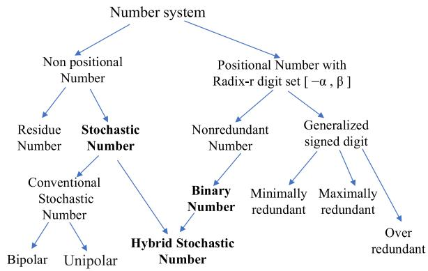

Fig. 1. SN, HSN, and classic BN system.

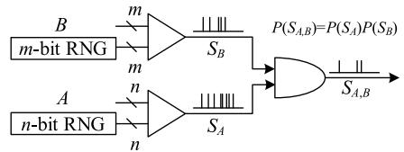

Fig. 2. SC with unipolar stochastic bitstreams.

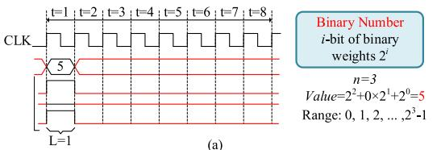

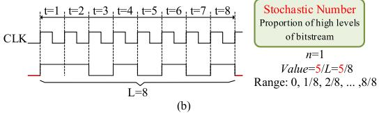

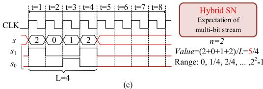

Fig. 3. Different representations of (a) BN, (b) SN, and (c) HSN.

$L$ , is defined as the relative frequency of the encoding of 1

$$
\hat {p} = \hat {p} (\mathrm {S N} = 1) = \frac {\sum_ {j = 0} ^ {L - 1} \mathrm {S N} (j)}{L} \in [ 0, 1 ] \tag {1}
$$

where $\textstyle \sum _ { j = 0 } ^ { L - 1 } \operatorname { S N } ( j )$ is the number of 1’s in the sequencecompared, and $\hat { p }$ is the estimated value of the probability. TheSN representation of a particular stream is not defined by theindividual value of a bit in a specific position; thus, the SCbelongs to a nonpositional number representation. SN usesa redundant number system, in which there are redundantrepresentations for each number, $\hat { p } ( \mathbf { S } \mathbf { N } = \mathbf { \Omega } ^ { 1 } )$ ). In redundantrepresentation, one algebraic value may be represented in morethan one way. For example, with bitstream length $L \ = \ 3$ ,there are three ways to represent 1/3: (0, 0, 1), (0, 1, 0), and(1, 0, 0).

The stochastic number associated with mapping from space-to-time encoding leads to SC arithmetic, which can be

implemented using simple logic gate circuits. As anothernonpositional representation, SC improves the robustness ofcircuits subject to random faults or component variability.

# C. Hybrid Number of Stochastic and Binary

A conventional fixed-radix BN system is typically basedon a positive integer radix (base) $r = 2$ and an implicit digitset [0, 1]. This is referred to as a positional-weighted (radix)system. Hence,

$$
B = b _ {n - 1} r ^ {n - 1} + \dots + b _ {1} r ^ {1} + b _ {0} r ^ {0} = \sum_ {i = 0} ^ {n - 1} b _ {i} \cdot r ^ {i}. \tag {2}
$$

Definition 1: Considering the representation of the SNin (1) with respect to the BN $B$ in (2), we have

$$
\begin{array}{l} \hat {E} [ S ] = \sum_ {i = 0} ^ {n - 1} r ^ {i} \cdot \hat {p} (S _ {i} = 1) = \sum_ {i = 0} ^ {n - 1} r ^ {i} \left(\frac {\sum_ {j = 0} ^ {L - 1} S _ {i} (j)}{L}\right) \\ = \frac {1}{L} \left(\sum_ {j = 0} ^ {L - 1} \sum_ {i = 0} ^ {n - 1} S _ {i} (j) \cdot 2 ^ {i}\right). \tag {3} \\ \end{array}
$$

Here, $S _ { i }$ represents the expanded SN representation, whichis a 2-D matrix consisting of 0–1 number stream. Every rowof $S _ { i }$ forms an SN, $S _ { i }$ represents the ith row of HSN. And,$S _ { i } ( j )$ represents the bit at i th row and $j$ th column of HSN.$\hat { E } [ S ]$ is the estimated value of the expectation of HSN. Basedon the representation system of (3), it shows that the HSNconsisting of multiple SN with different weights is actually abinary sequence. This expanded SN representation system iscalled an HSN, which still uses expectations to represent dataand probabilistic theory for computing [28], [29]. However,each bitstream of the HSN has a positional weight value basedon BN, where the weight is $2 ^ { i }$ . S represents an $n$ -bit HSN as

$$
S = S _ {n - 1} 2 ^ {n - 1} + \dots + S _ {1} 2 ^ {1} + S _ {0} 2 ^ {0} \tag {4}
$$

where $S _ { n - 1 } , \ldots , S _ { 1 }$ and $S _ { 0 }$ represent different SNs based onthe positional weight of the HSN. The expectation of $n$ -bitHSN is expressed as follows:

$$
E [ S ] = 2 ^ {n - 1} E \left[ S _ {n - 1} \right] + \dots + 2 ^ {1} E \left[ S _ {1} \right] + E \left[ S _ {0} \right] \tag {5}
$$

where $E [ S ]$ represents the expectation of different $S _ { i }$ of HSN.The range of values represented by $n$ -bit HSN is larger thanthat of a single SN, which the number ranges is from 0 to$2 ^ { n } - 1$ .

Example 1: We constructed an example of a binary sequencewith radix-2 from two elementary binary sequences with abitstream length $L$ of 16. Select elementary binary sequenceswith probabilities of $b _ { 1 }$ and $b _ { 0 }$ that

$$
\begin{array}{l} S = \left[ \begin{array}{c} S _ {1} \\ S _ {0} \end{array} \right] \\ = \left[ \begin{array}{c c c c} 1 1 0 1 & 1 1 1 1 & 1 1 0 1 & 0 0 1 1 \\ 1 0 1 1 & 0 1 0 0 & 1 0 0 1 & 1 1 1 1 \end{array} \right], \quad \hat {S} _ {1} = b _ {1} = 1 2 / 1 6   \hat {S} _ {0} = b _ {0} = 1 0 / 1 6. \\ \end{array}
$$

Subsequently, a new hybrid stream (HS) sequence HSN isconstructed from these two stream sequences, as follows:

$$
S = S _ {1} \times 2 ^ {1} + S _ {0} \times 2 ^ {0} = 3 2 1 3 2 3 2 2 3 2 0 3 1 1 3 3
$$

$$
\begin{array}{l} \hat {E} [ S ] = \frac {\sum_ {j = 0} ^ {L - 1} \left[ \sum_ {i = 0} ^ {n - 1} S _ {i} (j) \cdot 2 ^ {i} \right]}{L} = b _ {1} \times 2 ^ {1} + b _ {0} \times 2 ^ {0} \\ = \frac {3 + 2 + 1 + 3 + \cdots + 1 + 1 + 3 + 3}{1 6} \\ = \frac {3 4}{1 6} = 2 \times \frac {1 2}{1 6} + \frac {1 0}{1 6}. \\ \end{array}
$$

Hence, based on the definition of HSN, we can constructHSN sequences of arbitrary finite lengths from a set of SNsequences with binary weight.

Definition 2: Observing (3) of HSN.

1) It is BN, $S _ { i } ( j ) = b _ { i }$ at each $j , b _ { i }$ is 0 or 1

$$
\begin{array}{l l l l} \hat {E} [ S ] & = \frac {\sum_ {j = 0} ^ {L - 1} [ \sum_ {i = 0} ^ {n - 1} S _ {i} (j) \cdot 2 ^ {i} ]}{L} & = & \sum_ {i = 0} ^ {n - 1} b _ {i} \cdot 2 ^ {i}, \text {i f f}, n \\ 1 \text {a n d} L & = 1. \end{array} \geq
$$

2) It is conventional SN

$$
\begin{array}{l l l l} \hat {E} [ S ] & = & \frac {\sum_ {j = 0} ^ {L - 1} [ \sum_ {i = 0} ^ {n - 1} S _ {i} (j) \cdot 2 ^ {i} ]}{L} & = \\ 1, \text {a n d} L > 1. \end{array} \quad \begin{array}{l l l l} \hat {E} [ S ] & = & \frac {\sum_ {j = 0} ^ {L - 1} S (j)}{L}, \text {i f f}, n & = \\ 1, \text {a n d} L > 1. \end{array}
$$

3) It is HSN

$$
\hat {E} [ S ] = \frac {\sum_ {j = 0} ^ {L - 1} \left[ \sum_ {i = 0} ^ {n - 1} S _ {i} (j) \cdot 2 ^ {i} \right]}{L}, \text {i f f}, n \geq 1 \text {a n d} L \geq 1.
$$

The representations of SN and BN are two extremes of HSNand are two special types of HSN as shown in Fig. 3. TheHSN is represented by a parallel multi-bit stream and followsthe position number rule of BNs. The amount of informationcarried by a multi-bit stream HSN or the numerical represen-tation accuracy, has been significantly improved. Moreover,the bitstream length $( L )$ of HSN is significantly shortened forthe same precision number representation, which effectivelyaddresses the problem of high latency in the traditional SNrepresentation.

Unlike conventional BN systems, HSN systems are redun-dant number representation. Encoding the same number withan HSN may yield multiple representations, similar to an SN.For example, $( 2 , 0 , 1 , 2 ) _ { \mathrm { H S N } }$ , $( 2 , 1 , 1 , 1 ) _ { \mathrm { H S N } }$ , and (1, 3, 1,$0 ) _ { \mathrm { H S N } }$ have the same value because the mean values of thethree HSN are all equal to 5/4. Therefore, HSN systems arerepresentative of systems with redundant numbers.

Example 2: Binary number $x$ is encoded as an HSN. Thefirst step of generation is splitting $x$ into $n$ BN with a smallerbit width, $\mathrm { B N } _ { 0 }$ , $\mathrm { B N } _ { 1 }$ , . . . , BNn−1. The relationship between $x$and $\mathrm { B N } _ { i }$ is described as follows:

$$
x = \mathrm {B N} _ {n - 1} 2 ^ {n - 1} + \dots + \mathrm {B N} _ {1} 2 ^ {1} + \mathrm {B N} _ {0} 2 ^ {0}. \tag {6}
$$

The bit width of $\mathrm { B N } _ { i }$ is $k _ { i }$ , $k _ { i } ~ \in ~ N ^ { + }$ . The second step isto encode $\mathbf { B N } _ { 0 } , \dots , \mathbf { B N } _ { n - 1 }$ as an SN. They were comparedwith $k _ { \mathrm { m a x } }$ -bit RNG. Thus, the expectation of $n$ SNs carries thesame coefficient of $2 ^ { - k _ { \operatorname* { m a x } } }$ . $k _ { \mathrm { m a x } }$ is the maximum value of $k _ { i }$

$$
\left\{ \begin{array}{l l} \text {i f B N} _ {i} > \operatorname {R N G} (j), & S _ {i} (j) = 1 \\ \text {e l s e} & S _ {i} (j) = 0 \\ E [ S _ {i} ] = \operatorname {B N} _ {i} / 2 ^ {k _ {\max }} & (i = 0, 1, \dots , n - 1). \end{array} \right. \tag {7}
$$

Definition 3: By combining (4)–(7), the expectation of theHSN can be obtained as follows:

$$
E [ S ] = \sum_ {i = 0} ^ {n - 1} 2 ^ {i} E [ S _ {i} ] = \frac {\sum_ {i = 0} ^ {n - 1} 2 ^ {i} \mathrm {B N} _ {i}}{2 ^ {k}} = \frac {x}{2 ^ {k _ {\max }}}. \tag {8}
$$

The HSN output successfully represents $x$ , and its expecta-tion has a coefficient of $2 ^ { - k _ { \mathrm { m a x } } }$ . An example of the generation

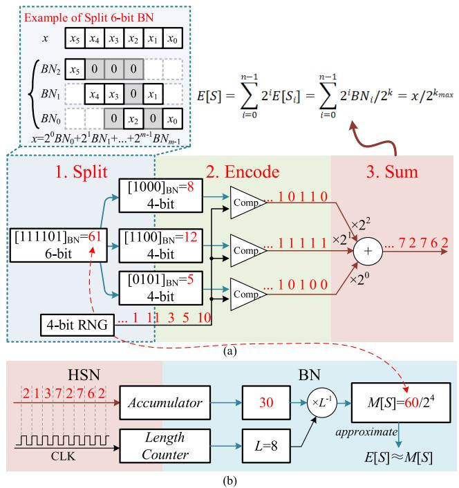

Fig. 4. Encoding and decoding processes of the HSN. (a) 6-bit BN is encodedas 3-bit HSN. (b) HSN is decoded as BN.

of a 3-bit HSN is provided in Fig. 4(a) to explain the detailsof the encoding circuit.

As aforementioned, the value represented by the HSN isdetermined by its expectation, which is obtained by countingthe mean of an HSN with infinite length, which is impossiblein real circuits. Therefore, the mean of an HSN with a finitelength stream is counted to obtain the approximate expectation,as shown in Fig. 4(b)

$$
E [ S ] = \lim  _ {L \rightarrow \infty} M [ S ] = \lim  _ {L \rightarrow \infty} \sum_ {t = 1} ^ {L} S (t) / L \tag {9}
$$

where $M [ S ]$ represents the mean value of S, and $s$ is anHSN. For the easy distinction between rows and columnsin the HSN, $S ( t )$ represents the number consisting of thetth column in S. This operation can be realized using anaccumulator and counter. An accumulator is used to count$\textstyle \sum _ { t = 1 } ^ { L } S ( t )$ , and a counter is used to count bitstream length $L$When $L = 2 ^ { n } , n \in N$ , the division can be replaced with ashifting.

# D. Arithmetic Operation of HSC

1) Multiplication: The most common situation is the mul-tiplication of two HSNs, as discussed in [29]. $S _ { a }$ and $S _ { b }$represent the two HSNs, and the bitstream lengths were both$L$ . The $S _ { c }$ expectation equals the product of $S _ { a }$ expectationand $S _ { b }$ expectation in the HSC. The relationship between theexpectations of the inputs and outputs of the multiplicationoperation is expressed as (10). Multiplication operation isrealized when $S _ { a }$ and $S _ { b }$ are independent

$$
\begin{array}{l} E [ S _ {c} ] = E [ S _ {a} \cdot S _ {b} ] \\ = E \left[ S _ {a} \right] \cdot E \left[ S _ {b} \right] \text {i f f} S _ {a}, S _ {b} \text {i n d e p e d e n t .} \tag {10} \\ \end{array}
$$

This type of multiplication can produce errors, the mainreasons for which are twofold. First, it is difficult to achievea completely independent relationship between the inputs.Second, the mean of the HSN with a finite length is used toapproximate the expectation of the HSN; which may produceerrors. An example of this method is presented in Fig. 5(a).In this example, the mean of the output HSN has no errors.However, this situation is a special case, and the error is notalways 0.

Suppose that the $S _ { a }$ and $S _ { b }$ are the $n$ -bit and $m$ -bit HSN,respectively. By changing (10) to a positionally weightedformat of the SN, $S _ { c }$ expression of the HSN is obtained

$$
\begin{array}{l} E \left[ S _ {c} \right] = E \left[ S _ {a} \cdot S _ {b} \right] \\ = E \left[ \left(\sum_ {i = 0} ^ {n - 1} 2 ^ {i} S _ {a, i}\right) \left(\sum_ {j = 0} ^ {m - 1} 2 ^ {j} S _ {b, j}\right) \right] \\ = \sum_ {i = 0} ^ {n - 1} \sum_ {j = 0} ^ {m - 1} 2 ^ {i + j} E \left[ S _ {a, i} \cdot S _ {b, j} \right] \tag {11.a} \\ \end{array}
$$

$$
\begin{array}{l} E \left[ S _ {c} \right] = \sum_ {i = 0} ^ {n - 1} \sum_ {j = 0} ^ {m - 1} 2 ^ {i + j} E \left[ S _ {a, i} \right] \cdot E \left[ S _ {b, j} \right] \\ = E \left[ S _ {a} \right] \cdot E \left[ S _ {b} \right] \text {i f f} S _ {a, i}, S _ {b, j} \text {i n d e p e d e n t .} \tag {11.b} \\ \end{array}
$$

$S _ { a , i }$ represents the ith SN with a weight of $2 ^ { i }$ in $S _ { a }$ , Sb, j issimilar. From the expectation expressions of (11), only whentwo SNs are in different HSNs, they are multiplied; thus, theyare required to be independent. The independence requirementcan be solved using existing schemes, such as Sobol [12] orindependent RNGs, and so on. As for the two SNs in the sameHSN, there is no multiplication between them, so they haveno independence requirement. Thus, the BN-to-SN encodingin the same HSN is allowed to use the same RNG, which doesnot violate the independence requirement of the multiplicationoperation.

As a concept of HSN in (3), the BN can be seen as aconstant HSN. Based on the properties of expectation, whenone of the inputs is replaced by a constant HSC, $E [ S _ { a } \cdot S _ { b } ] =$$E [ S _ { a } ] \cdot E [ S _ { b } ]$ is established unconditionally. Therefore, it isnot necessary for the independence requirement of multipli-cation, and the operation accuracy will not be impacted bynonindependent inputs. An example of the multiplication of$m$ -bit BN, $x ,$ , and $n$ -bit HSN, $S _ { a }$ , is shown in Fig. 5(b). Theoutput is an $( m + n )$ -bit HSN, and its bit width is determinedby the bit widths of the input BN and HSN. The expectationand mean of the output HSN, which realizes multiplicationwithout any other requirements, are as follows:

$$
M \left[ S _ {c} \right] = \sum_ {t = 1} ^ {L} x \cdot S _ {a} (t) / L = x \cdot M \left[ S _ {a} \right] \tag {12}
$$

$$
E \left[ S _ {c} \right] = E \left[ x \cdot S _ {a} \right] = x \cdot E \left[ S _ {a} \right]. \tag {13}
$$

In the HSC domain, nonindependent inputs be not influencethe computing. The computing error is only caused by theencoding accuracy of HSN; that is, the difference between themean of $\mathbf { S } _ { \mathbf { a } }$ and its expectation. When stream $L$ increases to$2 ^ { n + m - 1 }$ for $n$ -bit BN to $m$ -bit HSN, the encoding error is 0.

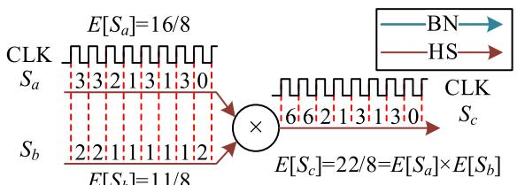

(a）)

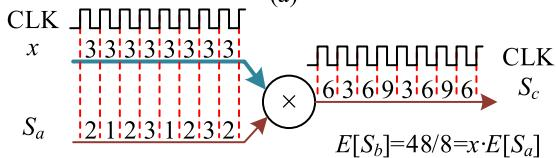

Fig. 5. Multiplication methods for HSC with different kinds of input.(a) $\mathrm { H S N } \times \mathrm { H S N }$ and (b) $\mathrm { B N } \times \mathrm { S N }$ , the bit width of output is changeable.

Therefore, its mean value is exactly equal to the expectation,and the computing of $\mathrm { H S N } \times \mathrm { B N }$ is completely accurate. Low-discrepancy sequences can be used as a random source in HSC,which yields a benefit on the encoding accuracy. Of course,a common LFSR or a counter in a classical SC scheme canalso work in HSC. Since the accuracy influence of randomsources on the whole multiplication only lies in the step of BN-to-HSN encoding, when $L$ is small, low-discrepancy sequenceshave better accuracy than others. As well known, deterministicsystems can achieve completely accurate computation. Thecomputation operation of HSC is too, that is no error inthe process of converting BN to HSN. Therefore, HSC canachieve completely accurate computation as the deterministicsystems. Moreover, HSC implement the higher efficiency bymultibit parallelism encoding, it has significant advantages incomputation latency.

2) Addition and Subtraction: HSC adder in arithmetic oper-ation is realized by the scaled addition, which consists of $n$MUXs with $n$ -bit HSN. Or it can use a binary adder to realizeaddition as shown in Fig. 6(b) and (c). Similar to multiplicationfor HSC, the input of three types of formats is used and theoutput is HSN.

The common situation is that the inputs are two HSNs. $S _ { a }$and $S _ { b }$ are two inputs of addition, and the stream lengths areboth L. $S _ { c }$ is the expectation of output HSC equal to the sumof the expectations of input $S _ { a }$ and $S _ { b }$ . This is achieved byadding the corresponding numbers in $S _ { a }$ and $S _ { b }$ together [29].The subtraction operation is the same as in addition, and thetwo operations are described in (14). The expectations and themean values of outputs are shown in the following equation:

$$
E \left[ S _ {c} \right] = E \left[ S _ {a} \pm S _ {b} \right] = E \left[ S _ {a} \right] \pm E \left[ S _ {b} \right] \tag {14}
$$

$$
M \left[ S _ {c} \right] = \frac {\sum_ {t = 1} ^ {L} \left[ S _ {a} (t) \pm S _ {b} (t) \right]}{L} = M \left[ S _ {a} \right] \pm M \left[ S _ {b} \right]. \tag {15}
$$

Here, the stream length $t$ takes every integer from 1 to $L$to generate $S _ { c } ( 1 )$ , Sc(2), . . . , $S _ { c } ( L )$ . In one signed HSN, thesituation including the negative $S ( t _ { i } )$ and the positive $S ( t _ { j } )$ isallowed and $t _ { i } \neq t _ { j }$ .

# III. NEURAL NETWORK IMPLEMENTATION OF HSC

# A. Activation Function Approximation

The calculation circuit for the activation function wasdesigned in the form of successive approximations. Function

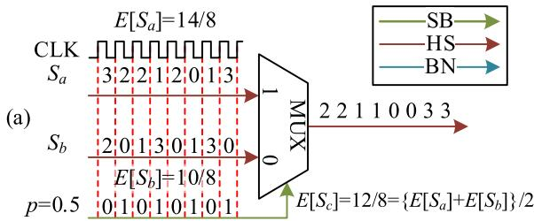

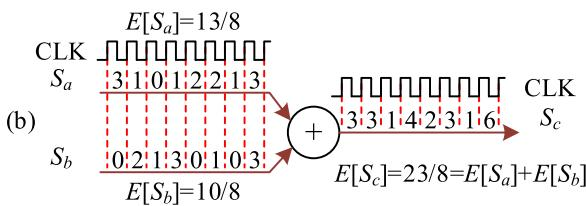

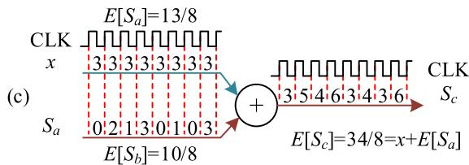

Fig. 6. Addition allows BN, SN, or HSN as input. (a) Scaled addition usingMUX (Multiplexer), (b) HSC adder with two inputs of HSN, and (c) HSCadder with two inputs of BN and HSN.

calculation in the HSC requires that the expectations of theinput and output ( $\scriptstyle { E _ { \mathrm { i n } } }$ and $E _ { \mathrm { o u t } } )$ ) satisfy a function, that is,$E _ { \mathrm { o u t } } = f ( E _ { \mathrm { i n } } )$ . However, the length of the HSC is limited.Thus, it uses the mean values of the HSN to replace theexpectation, that is, the input and output ( $M _ { \mathrm { i n } }$ and $M _ { \mathrm { o u t } } )$ ) is$M _ { \mathrm { o u t } } = f ( M _ { \mathrm { i n } } ) . \ S ( t )$ represents the HSN number $s$ , at time $t$ ,and (16) shows the relationship between $S ( t )$ , the mean value$( M )$ , and the summation (Sum). $L$ is the stream length of $S ( t )$ ,$t = 1 , 2 , \dots , L$

$$
\operatorname {S u m} = \sum_ {t = 1} ^ {L} S (t) = M \cdot L. \tag {16}
$$

According to (16), the functional relationship between $M _ { \mathrm { i n } }$and $M _ { \mathrm { o u t } }$ can be transformed as a function of $\mathrm { { \cal S u m } _ { \mathrm { i n } } }$ and$\mathrm { S u m _ { o u t } }$ , as shown in the following equation:

$$
M _ {\text {o u t}} = \frac {\operatorname {S u m} _ {\text {o u t}}}{L} = f \left(\frac {\operatorname {S u m} _ {\text {i n}}}{L}\right) = f \left(M _ {\text {i n}}\right). \tag {17}
$$

Thus, the relationship between $\mathrm { { \cal S u m } _ { \mathrm { i n } } }$ and $\mathrm { S u m _ { o u t } }$ isobtained. The function $g ( x )$ is the stretching transformationof $f ( x )$ , as follows:

$$
\operatorname {S u m} _ {\text {o u t}} = g \left(\operatorname {S u m} _ {\text {i n}}\right) = L \cdot f \left(\frac {\operatorname {S u m} _ {\text {i n}}}{L}\right). \tag {18}
$$

When $L$ is close to infinity, (17) is changed as follows:

$$
\begin{array}{l} E _ {\text {o u t}} = \lim  _ {L \rightarrow \infty} (M _ {\text {o u t}}) = \lim  _ {L \rightarrow \infty} \frac {g (\operatorname {S u m} _ {\text {i n}})}{L} \\ = f \left(\lim  _ {L \rightarrow \infty} \frac {\operatorname {S u m} _ {\mathrm {i n}}}{L}\right) = f \left(E _ {\mathrm {i n}}\right). \tag {19} \\ \end{array}
$$

To achieve the above relationship, $\mathrm { S u m _ { o u t } } = g ( \mathrm { S u m _ { i n } } )$ , andthe output HSN be obtained according to (20), which is the

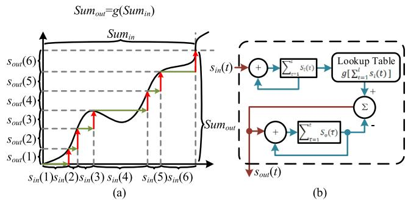

Fig. 7. Function calculation realized using successive approximation method.(a) Example for the process of successive approximation. (b) Circuit ofsuccessive approximation method.

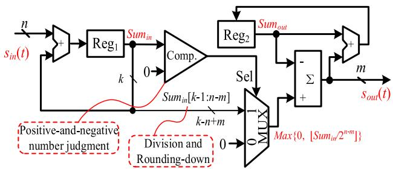

Fig. 8. Relu() function circuit realized using successive approximationmethod.

process of successive approximations, as shown in Fig. 7(a)

$$
S _ {\text {o u t}} (t) = \left\{ \begin{array}{l l} g \left[ S _ {\text {i n}} (1) \right], & t = 1 \\ g \left[ \sum_ {\tau = 1} ^ {t} S _ {\text {i n}} (\tau) \right] - \sum_ {\tau = 1} ^ {t - 1} S _ {\text {o u t}} (\tau), & t > 1. \end{array} \right. \tag {20}
$$

The sum of the output HSC is then obtained using thefollowing equation, which realizes the function calculation:

$$
\begin{array}{l} \operatorname {S u m} _ {\text {o u t}} = \sum_ {\tau = 1} ^ {L} S _ {\text {o u t}} (\tau) \\ = g \left[ \sum_ {\tau = 1} ^ {L} S _ {\mathrm {i n}} (\tau) \right] = g \left(\operatorname {S u m} _ {\mathrm {i n}}\right). \tag {21} \\ \end{array}
$$

The circuit is shown in Fig. 7(b). $S _ { i } ( t )$ is received by theaccumulator to obtain Ptτ=1 (21)(τ ). The function calculation, $\scriptstyle \sum _ { \tau = 1 } ^ { t } ( 2 1 ) ( \tau )$$g ( x )$ , can be realized using a lookup table (LUT) that can fitany function. $g ( x )$ is obtained from the origin function $f ( x )$according to (18). When the output of Relu() is $S _ { \mathrm { o u t } } ( t )$ , theReg2 accumulator receives $S _ { \mathrm { o u t } } ( t )$ to simultaneously obtain$\scriptstyle \sum _ { \tau = 1 } ^ { t } S _ { \mathrm { o u t } } ( \tau )$ .

Relu() function is a common activation function for theneural networks. It is implemented by using the successiveapproximation method. The LUT shown in Fig. 7(b) can bereplaced by the positive-and-negative number judgment cir-cuits in Fig. 8, which reduces the hardware cost. LeakyRelu()can also be implemented without LUT. The difference is thatthe input of port0 of MUX is $\scriptstyle a \sum _ { \tau = 1 } ^ { t } S _ { \mathrm { i n } } ( \tau )$ instead of 0 and $a$is a constant coefficient for LeakyRelu() to simplify the circuit,a is recommended to be $2 ^ { - k }$ , $k \in Z$ , and multiplication canbe achieved using a shift operation.

In addition, the output of HSN can be truncated to reducethe bit width. Considering Relu() as an example in Fig. 8, the

input bitwidth of HSC is $n$ -bit. To obtain the $m$ -bit outputHSN, the activation functions of (20) and (21) are replacedby the following equations:

$$
\begin{array}{l} \operatorname {S u m} _ {\text {o u t}} = \sum_ {\tau = 1} ^ {L} S _ {\text {o u t}} (\tau) \\ = \left\lfloor \frac {g \left[ \sum_ {\tau = 1} ^ {L} S _ {\mathrm {i n}} (\tau) \right]}{2 ^ {n - m}} \right\rfloor = \left\lfloor \frac {g \left(\operatorname {S u m} _ {\mathrm {i n}}\right)}{2 ^ {n - m}} \right\rfloor \tag {22} \\ \end{array}
$$

$$
S _ {\text {o u t}} (t) = \left\{ \begin{array}{l l} \left\lfloor \frac {g \left[ S _ {\text {i n}} (1) \right]}{2 ^ {n - m}} \right\rfloor , & t = 1 \\ \left\lfloor \frac {g \left[ \sum_ {\tau = 1} ^ {t} S _ {\text {i n}} (\tau) \right]}{2 ^ {n - m}} \right\rfloor - \sum_ {\tau = 1} ^ {t - 1} S _ {\text {o u t}} (\tau), & t > 1 \end{array} \right. \tag {23}
$$

where ⌊ ⌋ represents the rounding-down operation. In general,the truncation should take place subsequent to the Relu() oper-ation as in (22). However, it occurs prior to the Relu() opera-tion in Fig. 8. This adjustment is to reduce the input bit widthof MUX and has no influence on the computing results, whichis a special design for Relu() or LeakyRelu(). When calculatingother complex functions, the complex functions can alsotruncate the output HSN based on (22) and (23). This schemecan flexibly adjust the bit width of the output HSN, whichhelps to reduce the hardware overhead of the next cascadecircuit.

# B. Neuron Circuit

In a conventional SC, data must be repeatedly convertedbetween the SN and BN to avoid the impact of independence.Consequently, it is difficult for the circuit to realize a pipelinearchitecture, and a large amount of processing time is requiredfor data conversion, which leads to high latency. Thus, fromthe computing efficiency, that is operations per joule (or perarea) per second, due to the huge disadvantage in informationefficiency and encoding cost, the energy (or area) efficiencyof SC in reality is usually worse than that of traditional binarycomputing. The low-cost advantages of SC have not yet beenfully exploited. This problem is solved in the proposed HSC,where the data no longer needs to be converted between differ-ent formats, thus saving time cost and hardware overhead ofconversion. The HSC method can demonstrate its advantagesin large parallel and complex computational situations, suchas the neural networks.

The neuron circuit was designed based on HSC, as shown inFig. 9. A binary adder is used as an HSC adder in the design.Although binary adder costs a larger area than MUX adder,it can achieve higher computing accuracy and lower latency.$S _ { 1 } ( t )$ , $S _ { 2 } ( t ) , \ldots , S _ { i } ( t )$ are $n$ -bit HSs representing the inputsof neuron, $w _ { 1 }$ $w _ { 1 } , w _ { 2 } , \dotsc , w _ { j }$ , and bias are the parameters of theneurons that are stored as BN. The neuron uses Relu() as anactivation function, as shown in Fig. 8. Relu() also performsa truncation to ensure that the input and output HSN havethe same bit width. The same bit widths of the input andoutput HSs were used to realize the cascade connection ofmultiple neurons. Thus, the pipeline architecture of a neural

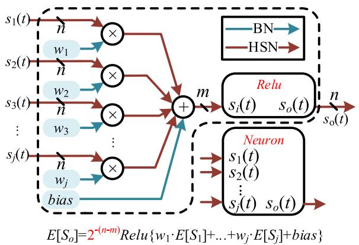

Fig. 9. Neuron structure based on HSC without any converters of weightand bias data. The input and output are HSN, and the bit width of outputHSN can be adjusted.

TABLE IHARDWARE RESULT FOR NEURON CIRCUIT WITHDIFFERENT NUMBER OF SYNAPSES

<table><tr><td>Number of Synapses</td><td colspan="2">Method</td><td>LUT</td><td>FF</td><td>Power (W)</td><td>Power per Synapse (mW)</td><td>L.</td></tr><tr><td rowspan="3">32</td><td rowspan="2">HSC</td><td>1-bit</td><td>388</td><td>344</td><td>0.02</td><td>0.63</td><td>256</td></tr><tr><td>2-bit</td><td>631</td><td>453</td><td>0.031</td><td>0.97</td><td>128</td></tr><tr><td colspan="2">B. (8-bit)</td><td>3142</td><td>1065</td><td>0.105</td><td>3.28</td><td>1</td></tr><tr><td rowspan="3">64</td><td rowspan="2">HSC</td><td>1-bit</td><td>736</td><td>667</td><td>0.036</td><td>0.56</td><td>256</td></tr><tr><td>2-bit</td><td>951</td><td>786</td><td>0.046</td><td>0.72</td><td>128</td></tr><tr><td colspan="2">B. (8-bit)</td><td>6249</td><td>2151</td><td>0.21</td><td>3.28</td><td>1</td></tr></table>

All data were obtained from the companion design suite of FPGA,KCU116.Clock frequency is $3 0 0 ~ \mathrm { M H z }$ .Bit width of input HSC is 1-bit or 2-bit. Theweight and bias are 8-bit BN.The circuits ofbinary are automatically optimizedfrom the design suite.B.represent Binary,L. represents Latency.

network can be formed to achieve low-latency performance.In addition, the data conversion problem of conventional SC,which is the repeated conversion between SN and BN, wasalso addressed.

Table I shows the implementation results of the neuroncircuit for different number of synapses based on HSC andtraditional binary, where the circuit of the HSC is implementedaccording to Fig. 9. $S _ { i } ( t )$ is set to 1-bit HSN, $w _ { j }$ , andbias is set to 8-bit signed BN. As the number of synapsesincreases, the cost of the Relu() circuit is averaged acrosseach synapse. Thus, the average power consumption in thecase of 64 inputs is slightly lower than that of 32 inputs.The hardware requirements of neurons realized by HSC(1-bit HSN) were less than $20 \%$ of that of neurons realizedby binary. The advantage of hardware cost for HSC can befurther expanded with the increase of bit width. The networkparameters are stored directly near the computing unit withoutrepeatedly reading data from the external memory. Thus,it avoids the problem that the speed of artificial intelligence(AI) accelerator with binary is constrained by the speed ofscheduling data.

# C. Application of Neural Network

Based on the neuron circuit shown in Fig. 9, a five-layerfully connected neural network is constructed to classify

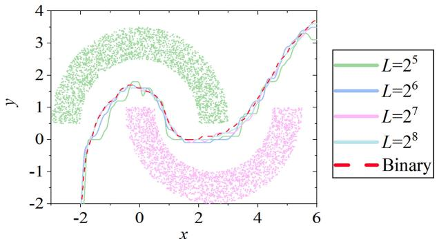

Fig. 10. Classification of two linear inseparability moons using deep network;$L$ is the stream length.

TABLE IIFPGA-BASED HARDWARE IMPLEMENTATIONOF DEEP NEURAL NETWORK

<table><tr><td>Bit Width of Quantization</td><td>LUT</td><td>FF</td><td>Power (W)</td></tr><tr><td>8-bit</td><td>53110</td><td>47503</td><td>2.389</td></tr><tr><td>Number of synapses</td><td>Clock Frequency (MHz)</td><td>computation Performance (TOPS)</td><td>Energy Efficiency (TOPS/W)</td></tr><tr><td>4544</td><td>300</td><td>2.726/L</td><td>1.141/L</td></tr></table>

All data were obtained from the companion design suite of FPGA,KCU116.L represents the bitstream length of HSC.

two linearly inseparability moons. The structure of the deepnetwork was [2, 64, 32, 32, 32, 2]. The classification results areshown in Fig. 10. Deep network training was performed usingsoftware (PyTorch and MATLAB). The weight and the bias ofthe network, including the inputs $x$ and $y$ , were subjected to8-bit quantization. The boundary of the binary classification isindicated by the red dashed line in Fig. 10. The classificationboundaries based on HSC with different stream lengths aredrawn as solid lines with different colors. When $L \ge 2 ^ { 6 }$ , thedifference in the boundary between the HSC and the binaryis still very small. Even if $L$ decreased to $2 ^ { 5 }$ , the boundaryobtained from the HSC could clearly distinguish between thetwo sets of points.

This neural network with HSC was verified using ahardware circuit. The main feature of the network withHSC is that it is the nonindependence of input datainstead of the independence requirement of traditional SCwhen multiple multiplications. The network in the testcontained 4544 synapses, which consisted of 4544 multiplies-accumulation (MAC). The implementation results are shownin Table II. The average hardware size of multiplier and adderis only 11.7 LUTs and 10.5 FFs. Under a 300-MHz clock,it can perform $2 . 7 2 6 \times 1 0 ^ { 1 2 } ]$ HSC operations per second (OPS)with a power of 2.389 W, equivalent to $2 . 7 2 6 / L \times 1 0 ^ { 1 2 }$ binaryOPS. $L$ is the bitstream length, which depends on accuracyrequirements.

The full connect (FC) neural network above based onHSC was implemented and fabricated by 40-nm CMOStechnology. The structure of the deep neural network wasset as [64, 32, 32, 32, 10] for classification on MNIST.Network training was performed using PyTorch. Because the

TABLE IIICOMPARISON WITH OTHER NEURAL NETWORK DESIGNS

<table><tr><td rowspan="3" colspan="2">Method</td><td colspan="5">SC</td><td colspan="4">BN</td><td rowspan="3" colspan="3">Proposed HSC(8-BIT)</td></tr><tr><td colspan="3">Conventional</td><td>Pipeline</td><td>Analog</td><td colspan="2">16-bit</td><td colspan="2">8-bit</td></tr><tr><td>[30]</td><td>[31]</td><td>[32]</td><td>[33]</td><td>[34]</td><td>[35]</td><td>[36]</td><td>[37]</td><td>[38]</td></tr><tr><td colspan="2">Process</td><td>ASIC45nm</td><td>ASIC45nm</td><td>ASIC45nm</td><td>ASIC45nm</td><td>ASIC65nm</td><td>FPGAVC709</td><td>FPGAGX1150</td><td>FPGAVX690T</td><td>ASIC16nm</td><td colspan="2">FPGAKCU116</td><td>ASIC40nm</td></tr><tr><td colspan="2">Number of MAC</td><td>25</td><td>256</td><td>512</td><td>550</td><td>-</td><td>2144</td><td>1320</td><td>1027</td><td>1024</td><td>10332</td><td>6804</td><td>4544</td></tr><tr><td colspan="2">Power (mW)</td><td>1.28</td><td>1490</td><td>2619.8</td><td>651</td><td>33.17</td><td>30200</td><td>37448</td><td>9180</td><td>4160</td><td>5852</td><td>3985</td><td>102.3</td></tr><tr><td colspan="2">Clock (MHz)</td><td>1136</td><td>561</td><td>1563</td><td>200</td><td>-</td><td>156</td><td>370</td><td>200</td><td>2001</td><td colspan="2">300</td><td>400</td></tr><tr><td rowspan="2">Area</td><td>mm2forASIC</td><td>0.00085</td><td>0.0012</td><td>1.09</td><td>2.01</td><td>1.321</td><td>-</td><td>-</td><td>-</td><td>3.1</td><td>-</td><td>-</td><td>0.53</td></tr><tr><td>LUT forFPGA</td><td>-</td><td>-</td><td>-</td><td>-</td><td>-</td><td>273805</td><td>437000</td><td>231761</td><td>-</td><td>115143</td><td>78401</td><td>-</td></tr><tr><td colspan="2">Length of SN (L)</td><td>2048</td><td>1024</td><td>1024</td><td>512</td><td>8</td><td>-</td><td>-</td><td>-</td><td>-</td><td colspan="3">32</td></tr><tr><td colspan="2">Latency (μs)</td><td>1.8</td><td>1.83</td><td>0.66</td><td>2.56</td><td>-</td><td>-</td><td>-</td><td>-</td><td>-</td><td colspan="2">0.11</td><td>0.08</td></tr><tr><td colspan="2">Network Model</td><td colspan="5">Lenet5Conv×3FC×3</td><td>AlexNetConv×5FC×3</td><td>-</td><td>VGG16Conv×13FC×3</td><td>-</td><td>Conv×8</td><td>Conv×4</td><td>FC×4</td></tr><tr><td colspan="2">Data Set</td><td colspan="2">MNIST</td><td colspan="2">Cifar10</td><td>MNIST</td><td>ImageNet</td><td>-</td><td>ImageNet</td><td>-</td><td>Cifar10</td><td>MNIST</td><td>MNIST</td></tr><tr><td colspan="2">Top-1 accuracy (%)</td><td>99.12</td><td>99.07</td><td>88</td><td>91</td><td>99.06</td><td>62.5</td><td>-</td><td>63.74</td><td>-</td><td>86.99</td><td>99.1</td><td>96.01</td></tr><tr><td colspan="2">Operation per Second(GOPS)</td><td>0.028</td><td>0.28</td><td>1.563</td><td>220</td><td>-</td><td>565.94</td><td>1790</td><td>760.83</td><td>4098</td><td>193.7</td><td>127.56</td><td>113.6</td></tr><tr><td colspan="2">Energy Efficiency(GOPS/W)</td><td>22</td><td>0.18</td><td>0.596</td><td>340</td><td>1039</td><td>22.15</td><td>47.8</td><td>82.88</td><td>985.1</td><td>33.10</td><td>32.01</td><td>1109.8</td></tr><tr><td colspan="2">Length×Area perMAC (only ASIC)</td><td>0.07</td><td>0.0048</td><td>2.18</td><td>1.87</td><td>-</td><td>-</td><td>-</td><td>-</td><td>-</td><td>-</td><td>-</td><td>0.0037</td></tr><tr><td colspan="2">Length×Powerper MAC per MHz</td><td>0.092</td><td>10.62</td><td>3.35</td><td>3.03</td><td>-</td><td>-</td><td>-</td><td>-</td><td>-</td><td>0.0604</td><td>0.0625</td><td>0.0018</td></tr></table>

Data were obtained from the companion design suite of FPGA KCU116 and 40 nm low-power CMOS process.

photos were resized as $8 \ \times \ 8$ from $2 8 ~ \times ~ 2 8$ to decreasethe number of MACs, the misclassification rate increasedto $3 . 8 9 \%$ using floating point number in software. Theweights and biases of the inputs data of the network, werequantized to 8-bit INT by MATLAB based on range linearsymmetric quantization method with a misclassification rateof $3 . 9 6 \%$ .

A die micrograph of the neural network is shown in Fig. 11,where the die area is $1 . 0 ~ \mathrm { m m } ^ { 2 }$ , and the core area of the neuralnetwork is only $0 . 7 3 \ \times \ 0 . 7 3 \ \mathrm { \ m m } ^ { 2 }$ . The network structureconsists of 4544 number of multiplies-accumulation (MAC),and the implementation results by application-specified inte-grated circuit (ASIC) are shown in Table III. Several designsbased on SC or binary are listed in Table III. ConventionalSC designs [30], [31], [32] are limited by the disadvantageof a long bitstream length, and their energy efficiency islower than that of binary designs implemented by ASIC.The design [33] using a pipeline architecture exhibited highenergy efficiency. The design [34] using an analog circuitto realize SC significantly improved the energy efficiency;however, only the first layer of their network was realizedusing SC. When the HSC network implemented by ASIC,it can perform $3 . 6 3 5 \times 1 0 ^ { 1 2 }$ HSC OPS $( 3 . 6 3 5 \times 1 0 ^ { 1 2 } / L =$$1 . 1 3 6 \times 1 0 ^ { 1 1 }$ binary OPS) with a power of $1 0 2 . 3 \ \mathrm { m W }$ undera 400-MHz clock. One $\mathrm { { S O P S } } = 1 / L$ OPS, where $L$ is thebitstream length, which depends on the accuracy requirements.The area efficiency was $6 . 8 2 \ T \mathrm { S O P S } / \mathrm { m m } ^ { 2 }$ , and the energyefficiency was 142.6–35.53 TSOPS/W (here, $L = 8 – 3 2 ,$ . TheHSC neural network $( L = 3 2$ ) achieved more than 50 timesthe energy efficiency of conventional SC designs, which is

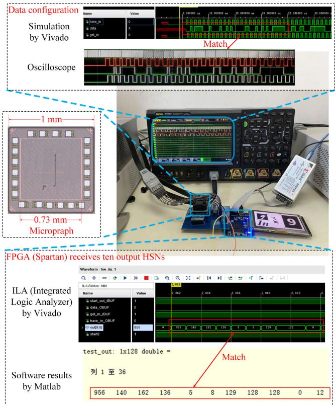

Fig. 11. Chip micrograph and numeral recognition experiment of neuralnetwork based on HSC. Accuracy reaches $9 6 . 0 1 \%$ on MNIST when $L = 3 2$ .The photograph is resized as $8 \times 8$ for the reduction in number of MACs.

similar to the performance of analog or binary-number neuralnetworks. Compared to an 8-bit int neural network, a network

based on HSC has very little loss in Top-1 accuracy, which has$0 . 0 3 \%$ decrease, from $9 6 . 0 1 \%$ to $9 6 . 0 4 \%$ . Benefits from therobustness of the neural network, small sacrifice on computa-tional accuracy have little impact on the inference accuracy.And, it is also verified by previous works [30], [31], [32], [33],[34], these SC designs all achieve good inference accuracy.When the bitstream length $L$ is compressed to eight, the energyefficiency of the neural network can be four times than $L =$32 although the miss rates will be increases to $1 1 . 3 \%$ .

At the same time, we also implemented two kinds of CNNmodels, which are four-layer CNN [(1, 8, 3), $( 8 , 8 , 3 ) \times 2$ ,and (8, 10, 3)] and eight-layer CNN [(3, 32, 3), (32, 32, 3) ×6, (32, 10, 3)], $( i , o , k )$ means (in channels, out channels,and kernel size). Two kinds of CNN were both implementedusing FPGA KCU116, and tested on the datasets MNIST andCifar-10, respectively. The experimental results are shown inTable III. The CNN based on FPGA can perform 127.56 and193.7 GOPS with number of MAC 6804 and 10332 under a300-MHz clock.

# IV. CONCLUSION

In this article, we proposed a new number representationcalled HSN and HSC method. This study first propoundedthe number representation from BN and SC to HSN, unifyingthe number representation and demonstrating the fundamen-tal properties of the HSC. The HSN is represented by themultibit stream stochastic number depending on the weight ofposition number system. The representations of 1-bit streamSN and BNs are two extremes and two types of specialexamples of HSN. The method of the expectation of multibitstreams proposed can achieve the complex computation ofHSC. Compared with the conventional SC, HSC realized highenergy efficiency, lower latency, and completely accurate com-putation. The rationality of the computing rules for multibitstreams is demonstrated and some basic arithmetic circuits forthe HSC system are designed too.

The circuits of activation function, neuro, and deep neuralnetwork with HSC were designed in this article. Five-layerneural network with an HSC was realized for a handwritenumeral recognition experiment of a $4 0 \mathrm { - n m }$ ASIC. The HSCnetwork achieved more than $5 0 \times$ the energy efficiency ofconventional SC designs, which is similar to the performanceof analog or binary designs. These applications illustrated thatthe HSC computing method has high performance than thetraditional SC, which avoids the obstacles of the conversionand latency in traditional SC. Thus, it demonstrates the mainadvantages of HSN, HSC theory to edge computing systemsand shows good application prospects in massively parallelcomputing.

# REFERENCES

[1] A. Avizienis, “Signed-digit numbe representations for fast parallel arith-metic,” IEEE Trans. Electron. Comput., vol. EC-10, no. 3, pp. 389–400,Sep. 1961.

[2] B. Parhami, “Generalized signed-digit number systems: A unifyingframework for redundant number representations,” IEEE Trans. Comput.,vol. 39, no. 1, pp. 89–98, Jan. 1990.

[3] B. R. Gaines, “Stochastic computing,” in Proc. Spring Joint Com-put. Conf. AFIPS (Spring), 1967, pp. 149–156, doi: 10.1145/1465482.1465505.

[4] W. J. Poppelbaum, C. Afuso, and J. W. Esch, “Stochastic computingelements and systems,” in Proc. Fall Joint Comput. Conf. AFIPS(Fall), 1967, pp. 635–644.

[5] B. D. Brown and H. C. Card, “Stochastic neural computation. I. Com-putational elements,” IEEE Trans. Comput., vol. 50, no. 9, pp. 891–905,Sep. 2001.

[6] A. Alaghi and J. P. Hayes, “Survey of stochastic computing,” ACMTrans. Embedded Comput. Syst., vol. 12, no. 2s, pp. 1–19, May 2013.

[7] J. P. Hayes, “Introduction to stochastic computing and its challenges,”in Proc. DAC, no. 59, 2015, pp. 1–3.

[8] B. R. Gaines, “Stochastic computing systems,” in Advances in Infor-mation Systems Science. Boston, MA, USA: Springer-Verlag, 1969,pp. 37–172.

[9] A. Alaghi, W. Qian, and J. P. Hayes, “The promise and challengeof stochastic computing,” IEEE Trans. Comput.-Aided Design Integr.Circuits Syst., vol. 37, no. 8, pp. 1515–1531, Aug. 2018.

[10] S. R. Faraji and K. Bazargan, “Hybrid binary-unary hardware accelera-tor,” IEEE Trans. Comput., vol. 69, no. 9, pp. 1308–1319, Sep. 2020.

[11] L. Sousa, “Nonconventional computer arithmetic circuits, systems andapplications,” IEEE Circuits Syst. Mag., vol. 21, no. 1, pp. 6–40,1st Quart., 2021.

[12] A. Khataei, G. Singh, and K. Bazargan, “Approximate hybrid binary-unary computing with applications in BERT language model and imageprocessing,” in Proc. ACM/SIGDA Int. Symp. Field Program. GateArrays, Feb. 2023, pp. 165–175.

[13] S. Liu and J. Han, “Energy efficient stochastic computing with sobolsequences,” in Proc. Design, Autom. Test Eur. Conf. Exhib. (DATE),Mar. 2017, pp. 650–653.

[14] S. Aygun, L. Kouhalvandi, M. H. Najafi, S. Ozoguz, and E. O. Gunes,“Hardware-software co-optimization of long-latency stochastic comput-ing,” IEEE Embedded Syst. Lett., early access, Sep. 25, 2023, doi:10.1109/LES.2023.3298734.

[15] X. Tang et al., “Delta sigma modulator-based dividers for accurate andlow latency stochastic computing systems,” IEEE J. Emerg. Sel. TopicsCircuits Syst., vol. 13, no. 1, pp. 270–284, Mar. 2023.

[16] M. H. Najafi, D. Jenson, D. J. Lilja, and M. D. Riedel, “Performingstochastic computation deterministically,” IEEE Trans. Very Large ScaleIntegr. (VLSI) Syst., vol. 27, no. 12, pp. 2925–2938, Dec. 2019.

[17] J. Wang, H. Chen, D. Wang, K. Mei, S. Zhang, and X. Fan,“A noise-driven heterogeneous stochastic computing multiplier forheuristic precision improvement in energy-efficient DNNs,” IEEE Trans.Comput.-Aided Design Integr. Circuits Syst., vol. 42, no. 2, pp. 630–643,Feb. 2023.

[18] Z. Xia, J. Chen, Q. Huang, J. Luo, and J. Hu, “Neural synaptic plasticity-inspired computing: A high computing efficient deep convolutionalneural network accelerator,” IEEE Trans. Circuits Syst. I, Reg. Papers,vol. 68, no. 2, pp. 728–740, Feb. 2021.

[19] H. Chen and J. Han, “Stochastic computational models for accuratereliability evaluation of logic circuits,” in Proc. 20th Symp. Great lakesSymp. (VLSI), May 2010, pp. 61–66.

[20] H. Aliee and H. R. Zarandi, “Fault tree analysis using stochastic logic: Areliable and high speed computing,” in Proc. Annu. Rel. MaintainabilitySymp., Jan. 2011, pp. 1–6.

[21] H. Sim, D. Nguyen, J. Lee, and K. Choi, “Scalable stochastic-computingaccelerator for convolutional neural networks,” in Proc. 22nd Asia SouthPacific Design Autom. Conf. (ASP-DAC), Jan. 2017, pp. 696–701.

[22] N. Temenos and P. P. Sotiriadis, “A stochastic computing sigma-deltaadder architecture for efficient neural network design,” IEEE J. Emerg.Sel. Topics Circuits Syst., vol. 13, no. 1, pp. 285–294, Mar. 2023.

[23] S. Khoram, K. Daruwalla, and M. Lipasti, “Energy-efficient Bayesianinference using bitstream computing,” IEEE Comput. Archit. Lett.,vol. 22, no. 1, pp. 37–40, Jan. 2023.

[24] P. Li, D. J. Lilja, W. Qian, K. Bazargan, and M. D. Riedel, “Computationon stochastic bit streams digital image processing case studies,” IEEETrans. Very Large Scale Integr. (VLSI) Syst., vol. 22, no. 3, pp. 449–462,Mar. 2014.

[25] W. J. Poppelbaum, “Statistical processors,” Adv. Comput., vol. 14,pp. 187–230, Jan. 1976.

[26] K. K. Parhi, “Analysis of stochastic logic circuits in unipolar, bipolarand hybrid formats,” in Proc. IEEE Int. Symp. Circuits Syst. (ISCAS),May 2017, pp. 1–4.

[27] V. Canals, A. Morro, A. Oliver, M. L. Alomar, and J. L. Rosselló,“A new stochastic computing methodology for efficient neural networkimplementation,” IEEE Trans. Neural Netw. Learn. Syst., vol. 27, no. 3,pp. 551–564, Mar. 2016.

[28] Y. Chen and H. Li, “Stochastic computing using amplitude and fre-quency encoding,” IEEE Trans. Very Large Scale Integr. (VLSI) Syst.,vol. 30, no. 5, pp. 656–660, May 2022.

[29] H. Li and Y. Chen, “Hybrid logic computing of binary and stochastic,”IEEE Embedded Syst. Lett., vol. 14, no. 4, pp. 171–174, Dec. 2022.

[30] S. R. Faraji, M. H. Najafi, B. Li, D. J. Lilja, and K. Bazargan, “Energy-efficient convolutional neural networks with deterministic bit-streamprocessing,” in Proc. Design, Autom. Test Eur. Conf. Exhib. (DATE),Mar. 2019, pp. 1757–1762.

[31] Z. Li et al., “HEIF: Highly efficient stochastic computing-based infer-ence framework for deep neural networks,” IEEE Trans. Comput.-AidedDesign Integr. Circuits Syst., vol. 38, no. 8, pp. 1543–1556, Aug. 2019.

[32] A. Zhakatayev, S. Lee, H. Sim, and J. Lee, “Sign-magnitude SC: Getting10X accuracy for free in stochastic computing for deep neural networks,”in Proc. 55th ACM/ESDA/IEEE Design Autom. Conf. (DAC), Jun. 2018,pp. 1–6, doi: 10.1109/DAC.2018.8465807.

[33] C. F. Frasser et al., “Fully parallel stochastic computing hardwareimplementation of convolutional neural networks for edge computingapplications,” IEEE Trans. Neural Netw. Learn. Syst., early access,Apr. 22, 2022, doi: 10.1109/TNNLS.2022.3166799.

[34] V. T. Lee, A. Alaghi, J. P. Hayes, V. Sathe, and L. Ceze, “Energy-efficienthybrid stochastic-binary neural networks for near-sensor computing,”in Proc. Design, Autom. Test Eur. Conf. Exhib. (DATE), Mar. 2017,pp. 13–18, doi: 10.23919/DATE.2017.7926951.

[35] H. X. Fan, L. Jiao, W. Cao, X. Zhou, and L. Wang, “A high performanceFPGA-based accelerator for large-scale convolutional neural networks,”in Proc. 26th Int. Conf. Field Program. Logic Appl. (FPL), Sep. 2016,pp. 1–9.

[36] J. Zhang and J. Li, “Improving the performance of OpenCL-based FPGAaccelerator for convolutional neural network,” in Proc. ACM/SIGDA Int.Symp. Field-Program. Gate Arrays, Feb. 2017, pp. 25–34.

[37] X. Lian, Z. Liu, Z. Song, J. Dai, W. Zhou, and X. Ji, “High-performanceFPGA-based CNN accelerator with block-floating-point arithmetic,”IEEE Trans. Very Large Scale Integr. (VLSI) Syst., vol. 27, no. 8,pp. 1874–1885, Aug. 2019.

[38] B. Zimmer et al., “A 0.32–128 TOPS, scalable multi-chip-module-based deep neural network inference accelerator with ground-referencedsignaling in 16 nm,” IEEE J. Solid-State Circuits, vol. 55, no. 4,pp. 920–932, Apr. 2020.

Hongge Li (Member, IEEE) received the Ph.D.degree in engineering from the Graduate Schoolof Information Sciences, Tohoku University, Sendai,Japan, in 2005.

From 2006 to 2008, he was an Assistant Pro-fessor with the Department of Bioengineering andRobotics, Tohoku University. He is currently aProfessor with the School of Electronic Infor-mation Engineering, Beihang University, Beijing,China. He has authored or coauthored more than90 scientific articles in journals and international

conferences, including the IEEE JOURNAL OF SOLID-STATE CIRCUITS(JSSC)\IEEE TRANSACTIONS ON VERY LARGE SCALE INTEGRATION(VLSI)\TCASII\IEEE EMBEDDED SYSTEMS LETTERS (ESL)\IEEE/OSAJOURNAL OF DISPLAY TECHNOLOGY (JDT)\TED\IEEE TRANSACTIONSON ELECTROMAGNETIC COMPATIBILIT (TEMC), Neurocomputing, Sensors,Microelectronics Journal, Microelectronics Reliability, Electronics Letters,JSID, and IEEE International Symposium on Circuits and Systems (ISCAS),and is an inventor of 20 patents. His current research interests include Stochas-tic computing (SC) circuits, panel display drivers/touch chip, neural network,electromagnetic interferences on chip, signal processing, and crossover studymethodologies for real-time hybrid systems.

Yuhao Chen (Student Member, IEEE) received theB.S. degree in electrical engineering from BeihangUniversity, Beijing, China, in 2019, where he iscurrently working toward the Ph.D. degree.

His current research interests include low-powerdesign, stochastic computing, neural networks, andneuromorphic computing.